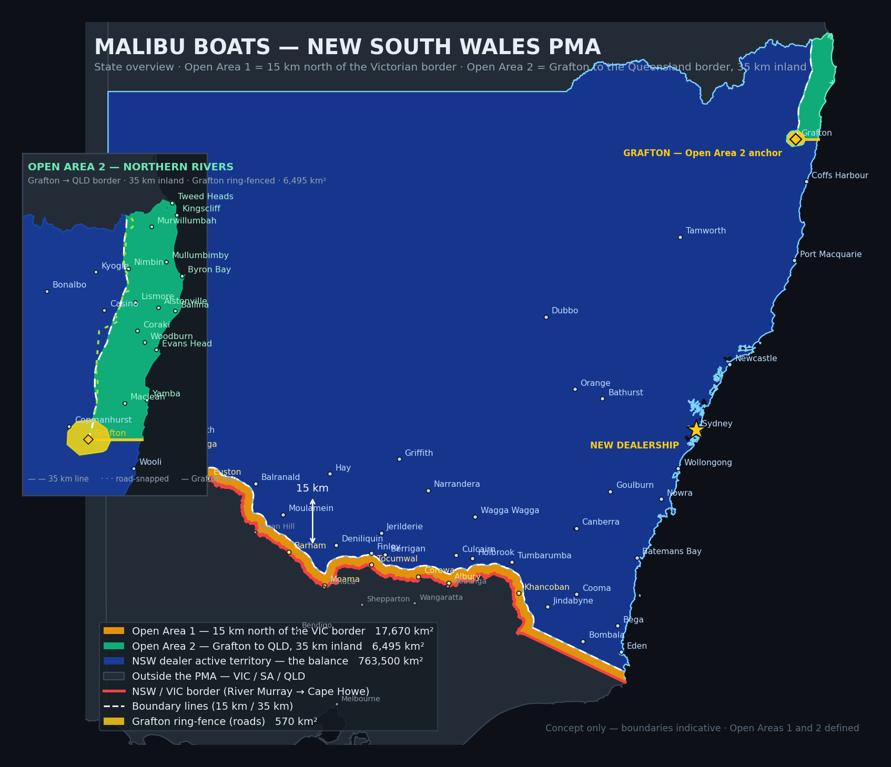

# Malibu Boats — NSW Primary Market Area

Interactive concept map for the New South Wales PMA supporting a new Malibu
dealership in Sydney.



## The territory rule

| Zone | Definition | Area |
|---|---|---|
| **Open Area 1** | Everything within **15 km north of the NSW/VIC border**, measured perpendicular to the border | 17,670 km² |
| **NSW dealer active territory** | The balance of New South Wales + the ACT | 763,500 km² |
| **Open Area 2** | The coastal strip from **Grafton north to the Queensland border**, held at Grafton's distance from the coast — **35.0 km** — with a straight line due east from Grafton to the sea as its southern edge, plus a 570 km² road-drawn ring-fence pulling the whole of Grafton inside | 6,495 km² |

The Victorian border runs 1,753 km: the River Murray from the South Australian
corner up to its source, then the straight survey line south-east to Cape Howe.

Open Area 2's western boundary is also published as a **road-snapped** variant that
follows real roads — the Summerland Way (B91) from Grafton to near Casino, the
Casino–Coraki Road, the Bruxner Highway (B60), Spring Grove Road, Kyogle Road,
Rock Valley Road, Nimbin Road and Routes 32/34 up to the Queensland border.
It comes out at 6,072 km², within 0.05% of the exact 35 km line.

> **Grafton sits exactly on the corner** — 35.2 km from the coast, on the southern
> boundary line. Whether the town itself falls inside Open Area 2 is a decision
> still to be made; the map marks it as an anchor rather than assigning it.

## What's in the map

`index.html` is a single self-contained file — no build step, no server, no
dependencies. Open it in any browser.

- **State overview / Detail / Satellite** view modes
- Base mapping with roads, towns and labels drawn *above* the territory shading
- Opacity slider to fade the overlays back
- Layer toggles for each zone, the border, and the 50 km line
- 4,118 towns and localities, each tagged with its zone and its distance from the Victorian border or from the coast
- **Point check** — click anywhere to get the zone, the exact distance to the border, and the nearest locality
- Town search

### Password

`index.html` is password-protected. The map is encrypted with AES-256-GCM
inside the file; the key is derived from the password with PBKDF2-HMAC-SHA256
(250,000 iterations). Viewing source shows ciphertext only. Decryption happens
entirely in the browser — nothing is transmitted, and it works offline.

Default password: **`malsyd`**

To change it, rebuild with `make lock PW=newpassword`.

> **Note:** anyone with the password can save the decrypted page. Treat this as
> controlling distribution, not as a guarantee against a determined leak.

## Base mapping — no API key required

The map uses **Esri's ArcGIS Online basemap tiles**, which are open and need no
key. `scripts/verify_no_api_key.py` asserts the map makes zero requests to any
keyed provider (last run: 0 CARTO requests, 180 Esri requests).

Attribution is mandatory and appears bottom-right — leave it in place.

CARTO's basemaps now require a free key and stamp `API KEY REQUIRED` across the
tiles without one. To go back to CARTO, put your key in `CARTO_API_KEY` at the
top of `scripts/template.html`; leave it blank for Esri. Note the parameter is
`?key=`, not `?api_key=`.

## Publishing to GitHub Pages

1. Push this repository to GitHub.
2. **Settings → Pages → Source: Deploy from a branch**, branch `main`, folder `/ (root)`.
3. The map is live at `https://<user>.github.io/<repo>/`.

`.nojekyll` is included so Pages serves the files as-is.

> `local/` holds the **unprotected** copy of the map and is git-ignored. Keep it
> that way — committing it would defeat the password.

## Repository layout

```
index.html                  Password-protected map (this is what gets published)
assets/state-overview.png   Static state-level overview
data/pma.geojson            Territory polygons, border and boundary lines (WGS84)
data/towns.json             Localities with zone + distance to border
docs/METHODOLOGY.md         How the geometry was computed, and its limits
data/open_area_2_road_snap.json  OSM road-snap samples for Open Area 2
scripts/                    Reproducible build
local/                      Unprotected map — git-ignored
```

## Rebuilding

```bash
pip install -r scripts/requirements.txt
make            # fetch data → compute geometry → build map → apply password
```

Individual steps: `make data`, `make geometry`, `make map`, `make lock PW=…`.

## Data sources

| Dataset | Source | Licence |
|---|---|---|
| State boundaries | [rowanhogan/australian-states](https://github.com/rowanhogan/australian-states) | Open |
| Road network — Open Area 1 | [Natural Earth 10m roads](https://www.naturalearthdata.com/) | Public domain |
| Road network — Open Area 2 | OpenStreetMap via Overpass API | ODbL |
| Localities | [matthewproctor/australianpostcodes](https://github.com/matthewproctor/australianpostcodes) | Open |
| Base mapping | © OpenStreetMap contributors, © CARTO; imagery © Esri | ODbL / see providers |
| Map library | [Leaflet](https://leafletjs.com/) 1.9.4 | BSD-2-Clause |

## Disclaimer

Concept map for territory planning discussion. Boundaries are indicative and
this is not a legal instrument. Confirm any boundary against a surveyed
description before it goes into a dealer agreement.
